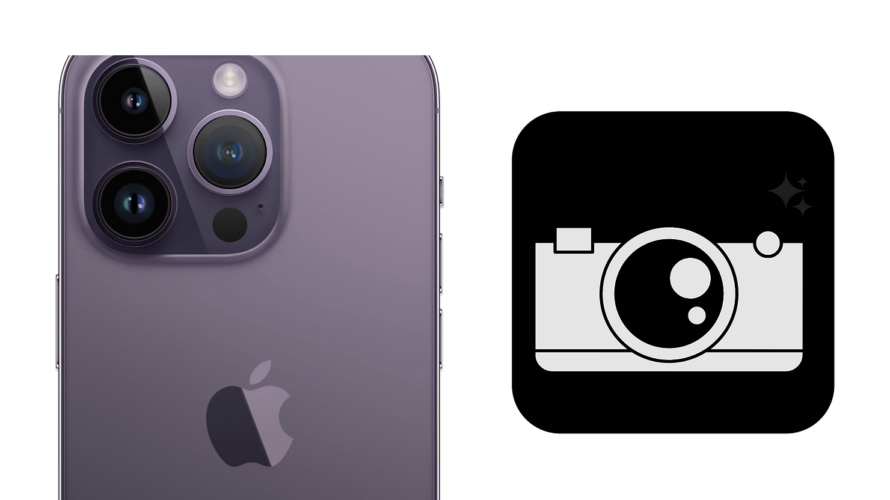

# Augmenting the IOS camera app

Have you ever noticed that some of your best ideas come to you when you're out of your routine? That's certainly been true for me and led to this story.

This post will take you through a journey that involves a geyser, the feeling of belonging and engineering. Ready? Let’s dive in!

## The origin of the idea

As I wrote above, most flash ideas come to me in when I am on the move, or far from my routine of doing research in the lab.

I am fascinated by how much our phones empower us. These small yet complex pieces of engineering are extremely powerful tools at arm’s reach.

What do I mean by that? Well, think about the fact that this little device allows you to speak to anyone almost anywhere at any time, prevents you from losing yourself in an unknown city and can even summon a car with a driver to take you wherever you want!

I remember being fascinated you could do these things with cheat codes in Grand Theft Auto, but doing that in real life is absolutely marvellous!

Even more insane is that anyone with the skills to code can harness that power to create something truly useful and impactful.

When you can code, you get the power to turn an idea into a concrete usable product for you and others to use. Isn’t that fascinating?

Anyway, back to the moment when this idea popped up.

We were at home, looking at photo albums of facility trips from a few years ago. The vision of these images pulls back good memories and we imagine ourselves back where we were.

However, As I was looking through these photo albums, I noticed that many of the pictures were taken by the same person, meaning that they were absent from the memories.

I keep this observation for myself and will remind myself that we should switch photographer from time to time for everyone to appear in the memories.

This observation stays at the back of my mind, I remember cogitating during the car ride back that day and then it slowly slid to the background.

The mental geyser

It is only a few weeks later, as I was not thinking about this at all, that something clicked in my head. It felt just like a surprise birthday party: it does not warn you in advance and a lot of things go through your mind at once when it happens.

At this moment, my brain had unconsciously made the link between the problem I had noticed on the photo album and a feature on modern phones. These days modern phones have 2 cameras: one at the front and one at the back. SO, if you take a picture of your group, you can at the same time take a selfie, superimpose it onto the group picture and BOOM: everyone is on the final shot!

Then, my brain sends a ton of possible extensions to this idea at me like the different shapes the selfie could have, how to automatically find a good size and place for the selfie using face detection algorithms, and whether or not the user should be able to edit the combined shot, … In a split second, a lot of thoughts jump at me, my mind moves fast and it feels almost like I am creating an app in my head.

I grab a pen, paper, and start capturing as much as I can of this geyser.

An idea was born.

## The building process

At that time, I had limited skills in mobile development. The only things under my belt were toy projects including a counter to keep track of my brother’s accuracy at serving in tennis and a small diary to log our expenses while on holiday (like a mini version of tricount).

I had no idea about anything camera-related, image processing and, what seemed at that time to be the worst, how to send an app to the store.

Because I made mistakes along the way, getting this app out has taken what one would call quite a bit of time. If I had to summarise them in just two points, it would look something like this:

### 1. No need to overprotect an idea

Just after the geyser of ideas popped into my mind, I felt scared of one thing: this app does not look really complicated to reproduce for an experienced developer, what if some big company with bigger means than me hears about this project and steals it?

While this might sound like an irrational fear to you now, and it definitely does to me, I promise that I was genuinely worried back at the beginning of the project. I looked at online resources on intellectual property and how to protect an idea, I really took this seriously.

However, now that the app is out, I realise that I should not have given so much attention to this concern. Yes, this is a relatively easy product to reproduce for someone who knows what they are doing, but no company would have come across my work back then. I realised at some point that worrying about this idea being stolen was just slowing me down and prevented me from actually crafting the thing so I decided to go on with it and see how it unfolds.

### 2. Better done than perfect

Ok, I hear you already: “Paul, I’ve heard this one everywhere, how come did you not know that??”

To this, my answer is you never really understand a lesson until you put it into practice. Of course, just like you I had heard this sentence before starting this project, but acting accordingly was a different story.

As I wrote above. I had so many feature ideas for this app about the 2 photos being taken at the same time (turns out Apple does not allow that), different ways of incorporating the selfie in the group picture, using AI for background removal, ...

Implementing all the features I had in mind and building the perfect exact representation of what popped into my head that day would have taken a lot of time. Plus, what tells me that future users would share my vision and like all of these features?

Once I realised how my chase for perfection made me constantly postpone the release of the app, I decided to strip it to the strict minimum and ship it like so on the store.

After a bit of coding, setting up a developer account with apple and getting designs for the store page, Grouppic was out!

## Conclusion

It’s been a few weeks now that Grouppic is out. This app empowers users to easily combine group photos and selfies to create a final image in which everyone is present. I hope you find it as useful and fun as I do!

I hope you enjoyed reading this post as much as I enjoyed designing this app!

Give Grouppic a go and send me feedback through the store or on social media.

Finally, don’t hesitate to share this article with your friends - that would mean the world to me.

Happy problem-solving!
